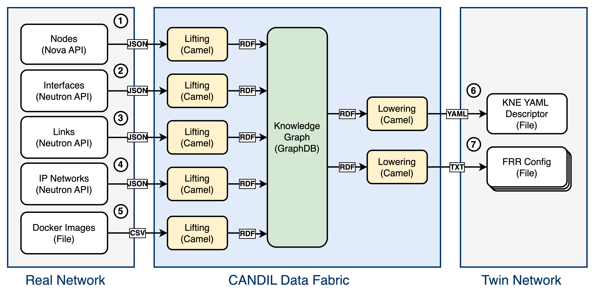

# Mouseworld Knowledge Graph

This repository contains the Apache Camel routes used to deploy a twin network based on the Mouseworld Knowledge Graph. This knowledge graph is aligned with the [MW Ontology](https://github.com/Mouseworld-Lab/mouseworld-ontology).

The figure below depicts the pipelines that implement semantic lifting of data sources from the real network and semantic lowering to data consumers of the twin network.



Before executing the Camel routes, deploy GraphDB container:

```bash
docker container run --rm -it -p 7200:7200 \
  -v ./graphdb/data:/opt/graphdb/home \
  -v ./graphdb/imports:/root/graphdb-import \
  ontotext/graphdb:10.7.0
```

Once GraphDB has started, make sure to create a repository in the database.
